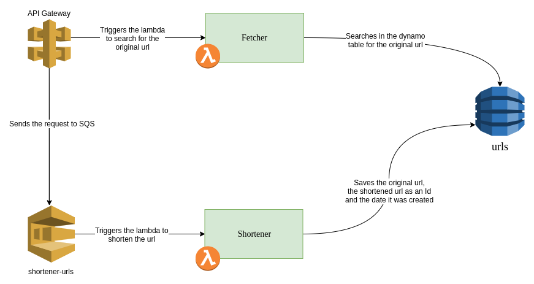

# Shorty Serverless

Serverless version of an url shortener.



## API Contract

### Request example

```bash
POST host.com/shorty/shorten
```

### Payload schema

```json
{
  "name": "Url",
  "fields": [
    {
      "name": "url",
      "type": "string",
      "doc": "URL to be shortened"
    }
  ]
}
```

### Response schema

```json
{
  "name": "UrlResponse",
  "fields": [
    {
      "name": "url",
      "type": "string",
      "doc": "Original URL"
    },
    {
      "name": "shortened_url",
      "type": "string",
      "doc": "Shortened URL"
    }
  ]
}
```