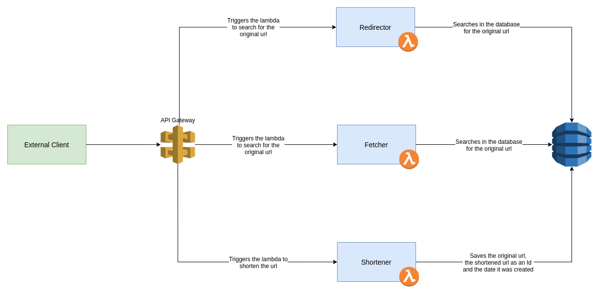

# Serverless URL shortener

Serverless URL shortener.

## Architecture



## API Contract

### Shorten URL

```bash
POST host.com/shortener/shorten
```

### Request schema

Avro schema for the request.

```json
{
  "name": "ShortenUrlRequest",
  "fields": [
    {
      "name": "url",
      "type": "string",
      "doc": "URL to be shortened"
    }
  ]
}
```

#### Example

```json
{
  "url": "www.aridiculouslyunnecessaryverylongdns.com"
}
```

### Response schema

Avro schema for the response.

```json
{
  "name": "ShortenUrlResponse",
  "fields": [
    {
      "name": "url",
      "type": "string",
      "doc": "Original URL"
    },
    {
      "name": "shortened_url",
      "type": "string",
      "doc": "Shortened URL"
    }
  ]
}
```

#### Example

```json
{
  "url": "www.aridiculouslyunnecessaryverylongdns.com",
  "shortened_url": "codefortheurl"
}
```

### Get shorten URL

```bash
GET host.com/shortener/{codefortheurl}
```

### Response schema

Avro schema for the response.

```json
{
  "name": "UrlResponse",
  "fields": [
    {
      "name": "url",
      "type": "string",
      "doc": "Original URL"
    }
  ]
}
```

#### Example

```json
{
  "url": "www.aridiculouslyunnecessaryverylongdns.com"
}
```

### Redirect to original URL

```bash
GET host.com/{codefortheurl}
```

Redirects to the original URL.
